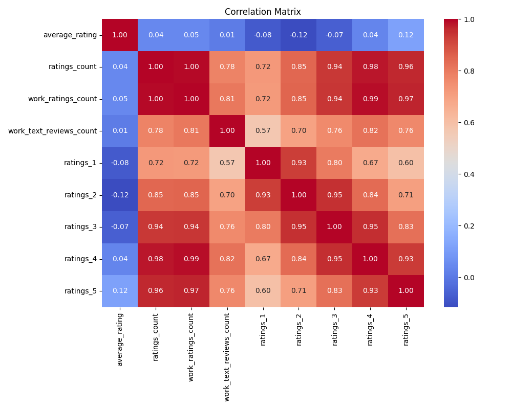
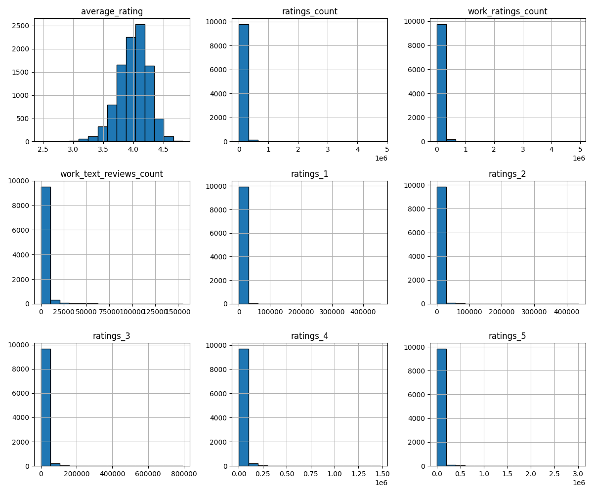
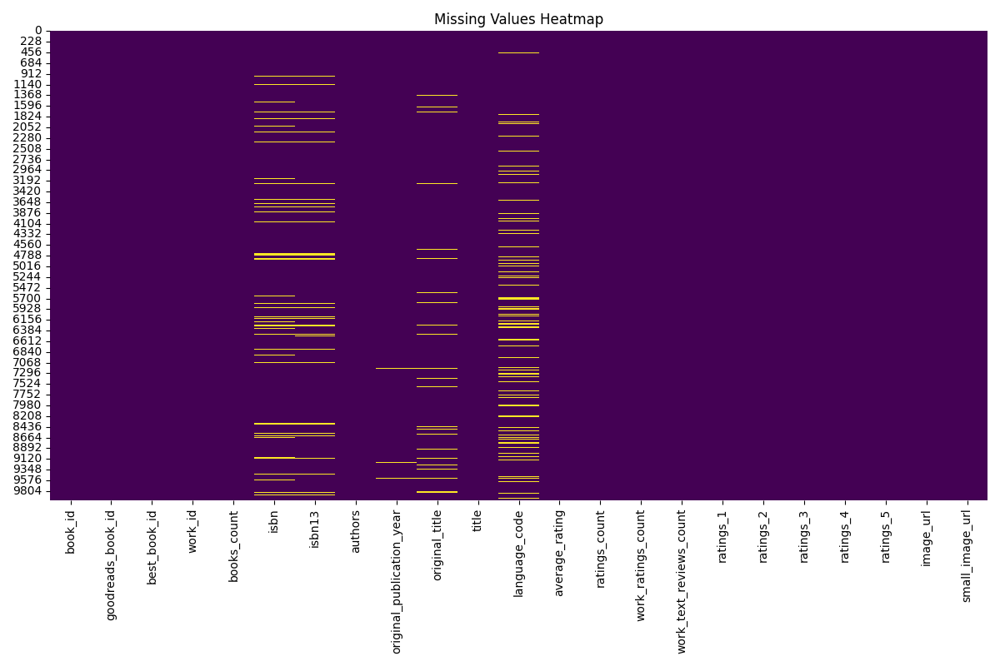

# Data Analysis Story for goodreads.csv

## Summary Statistics
            book_id  goodreads_book_id  best_book_id       work_id   books_count       isbn        isbn13       authors  original_publication_year original_title           title language_code  average_rating  ratings_count  work_ratings_count  work_text_reviews_count      ratings_1      ratings_2      ratings_3     ratings_4     ratings_5                                                                                 image_url                                                                         small_image_url
count   10000.00000       1.000000e+04  1.000000e+04  1.000000e+04  10000.000000       9300  9.415000e+03         10000                9979.000000           9415           10000          8916    10000.000000   1.000000e+04        1.000000e+04             10000.000000   10000.000000   10000.000000   10000.000000  1.000000e+04  1.000000e+04                                                                                     10000                                                                                   10000
unique          NaN                NaN           NaN           NaN           NaN       9300           NaN          4664                        NaN           9274            9964            25             NaN            NaN                 NaN                      NaN            NaN            NaN            NaN           NaN           NaN                                                                                      6669                                                                                    6669
top             NaN                NaN           NaN           NaN           NaN  375700455           NaN  Stephen King                        NaN                 Selected Poems           eng             NaN            NaN                 NaN                      NaN            NaN            NaN            NaN           NaN           NaN  https://s.gr-assets.com/assets/nophoto/book/111x148-bcc042a9c91a29c1d680899eff700a03.png  https://s.gr-assets.com/assets/nophoto/book/50x75-a91bf249278a81aabab721ef782c4a74.png
freq            NaN                NaN           NaN           NaN           NaN          1           NaN            60                        NaN              5               4          6341             NaN            NaN                 NaN                      NaN            NaN            NaN            NaN           NaN           NaN                                                                                      3332                                                                                    3332
mean     5000.50000       5.264697e+06  5.471214e+06  8.646183e+06     75.712700        NaN  9.755044e+12           NaN                1981.987674            NaN             NaN           NaN        4.002191   5.400124e+04        5.968732e+04              2919.955300    1345.040600    3110.885000   11475.893800  1.996570e+04  2.378981e+04                                                                                       NaN                                                                                     NaN
std      2886.89568       7.575462e+06  7.827330e+06  1.175106e+07    170.470728        NaN  4.428619e+11           NaN                 152.576665            NaN             NaN           NaN        0.254427   1.573700e+05        1.678038e+05              6124.378132    6635.626263    9717.123578   28546.449183  5.144736e+04  7.976889e+04                                                                                       NaN                                                                                     NaN
min         1.00000       1.000000e+00  1.000000e+00  8.700000e+01      1.000000        NaN  1.951703e+08           NaN               -1750.000000            NaN             NaN           NaN        2.470000   2.716000e+03        5.510000e+03                 3.000000      11.000000      30.000000     323.000000  7.500000e+02  7.540000e+02                                                                                       NaN                                                                                     NaN
25%      2500.75000       4.627575e+04  4.791175e+04  1.008841e+06     23.000000        NaN  9.780316e+12           NaN                1990.000000            NaN             NaN           NaN        3.850000   1.356875e+04        1.543875e+04               694.000000     196.000000     656.000000    3112.000000  5.405750e+03  5.334000e+03                                                                                       NaN                                                                                     NaN
50%      5000.50000       3.949655e+05  4.251235e+05  2.719524e+06     40.000000        NaN  9.780452e+12           NaN                2004.000000            NaN             NaN           NaN        4.020000   2.115550e+04        2.383250e+04              1402.000000     391.000000    1163.000000    4894.000000  8.269500e+03  8.836000e+03                                                                                       NaN                                                                                     NaN
75%      7500.25000       9.382225e+06  9.636112e+06  1.451775e+07     67.000000        NaN  9.780831e+12           NaN                2011.000000            NaN             NaN           NaN        4.180000   4.105350e+04        4.591500e+04              2744.250000     885.000000    2353.250000    9287.000000  1.602350e+04  1.730450e+04                                                                                       NaN                                                                                     NaN
max     10000.00000       3.328864e+07  3.553423e+07  5.639960e+07   3455.000000        NaN  9.790008e+12           NaN                2017.000000            NaN             NaN           NaN        4.820000   4.780653e+06        4.942365e+06            155254.000000  456191.000000  436802.000000  793319.000000  1.481305e+06  3.011543e+06                                                                                       NaN                                                                                     NaN

## Outlier Counts
book_id                        0
goodreads_book_id             78
best_book_id                  87
work_id                      254
books_count                  178
isbn13                        33
original_publication_year     53
average_rating                72
ratings_count                108
work_ratings_count           119
work_text_reviews_count      151
ratings_1                     73
ratings_2                    121
ratings_3                    135
ratings_4                    134
ratings_5                    108

## Story and Insights
### Data Analysis Insights and Narrative

#### Overview of the Dataset
The dataset comprises 10,000 book entries with various attributes, including ratings, reviews, publication years, and author information. The analysis focuses on the relationships between average ratings, rating counts, and textual reviews, revealing patterns, correlations, and potential anomalies.

#### Key Insights

1. **Average Ratings and Distribution**:
   - The average rating across books is approximately 4.00, indicating a generally positive perception of the books.
   - However, there are discrepancies in individual book ratings, as evidenced by the presence of outliers in average ratings (72 outliers) and ratings counts (108 outliers).

2. **Correlation Analysis**:
   - **Ratings Count vs. Average Rating**: The correlation between ratings count and average rating is weak (0.045). This suggests that a high number of ratings does not necessarily lead to a higher average rating, indicating that books can have many ratings without achieving high scores.
   - **Work Ratings Count**: This variable shows a strong correlation with both ratings count (0.995) and average rating (0.045). This implies that books with more ratings tend to have more ratings recorded for their work, but not necessarily higher average ratings.
   - **Ratings Breakdown**: There are strong correlations (above 0.9) between the counts of different ratings (e.g., ratings_3, ratings_4, ratings_5). This indicates that if a book receives a high count of lower ratings (like 3), it is likely to have a moderately high count of higher ratings (4 and 5).

3. **Anomalies in Publication Year**:
   - The dataset contains records of books published as early as 1750 and as late as 2017. This broad range includes classics and contemporary works, which may skew the average ratings based on historical context and readership preferences.

4. **Influence of Ratings on Reviews**:
   - The correlation (0.779) between work ratings count and work text reviews count suggests that books with a significant number of ratings also tend to have more written reviews. This could imply that readers who are engaged enough to rate a book are often motivated to leave a comment or review.

5. **Author Popularity**:
   - The dataset shows a notable presence of works by popular authors (e.g., Stephen King), as indicated by the frequency of author listings (60 occurrences for the top author). This may affect the average ratings and ratings counts, leading to potential bias in the data.

#### Trends and Observations
- **Positive Rating Bias**: The average rating of 4.00 suggests a positive bias in ratings. This could stem from a self-selection of readers who are likely to enjoy the books they read or the tendency of readers to rate only books they like.
- **Review Engagement**: Higher engagement in terms of reviews may reflect reader sentiment and could be valuable for authors and publishers in understanding audience feedback.
  
#### Implications of Findings
1. **For Authors and Publishers**:
   - The weak correlation between ratings count and average rating suggests that simply encouraging more ratings may not improve perceived book quality. Instead, focusing on reader engagement through meaningful content and interactions could enhance both ratings and reviews.
   - Given the strong correlation between ratings counts and reviews, encouraging readers to leave reviews could provide valuable insights into book reception.

2. **For Readers**:
   - Readers may want to consider not just the average rating but also the number of ratings and reviews to gauge the popularity and reception of a book more accurately.

3. **For Data Analysts**:
   - The dataset might benefit from additional cleaning to address outliers that may distort average ratings and analyses. Identifying and understanding the reasons behind these outliers could provide deeper insights into reader behavior.

#### Suggested Actions
- **Encourage Reviews**: Implement strategies to prompt readers to leave reviews after reading, such as follow-up emails or incentives. This could enhance the richness of data available for future readers.
- **Segment Analysis**: Further analyze ratings by genre, publication year, and author to identify specific trends that may not be visible in the aggregate data.
- **Monitor Outliers**: Investigate outliers further to determine if they represent genuine anomalies or if they indicate broader trends regarding specific books or authors.
- **User Education**: Create educational content for readers that explains how to interpret ratings and reviews, helping them make informed reading choices.

### Conclusion
This analysis reveals critical insights into readers' engagement with books, the complexities of average ratings, and the importance of reviews in book appreciation. By understanding these dynamics, stakeholders in the literary community can tailor their strategies to enhance reader engagement and satisfaction.

## Visualizations
### Correlation Plot

### Histogram

### Missing Values Heatmap

