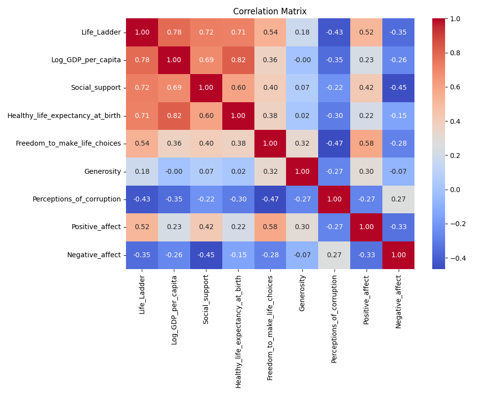
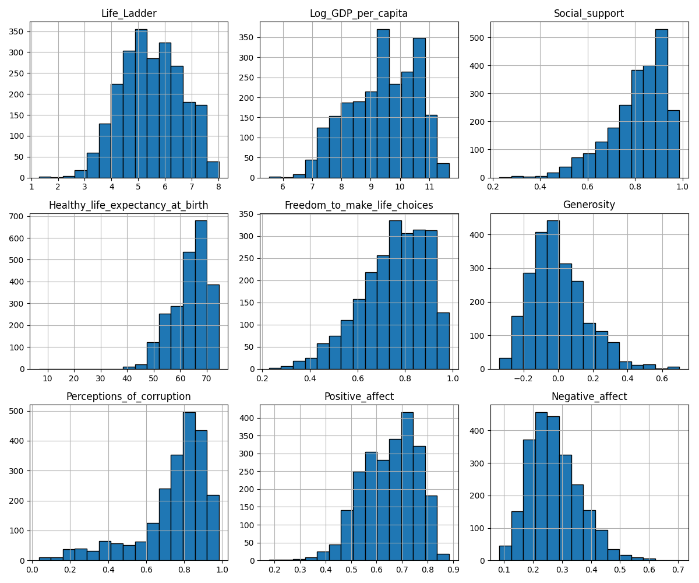
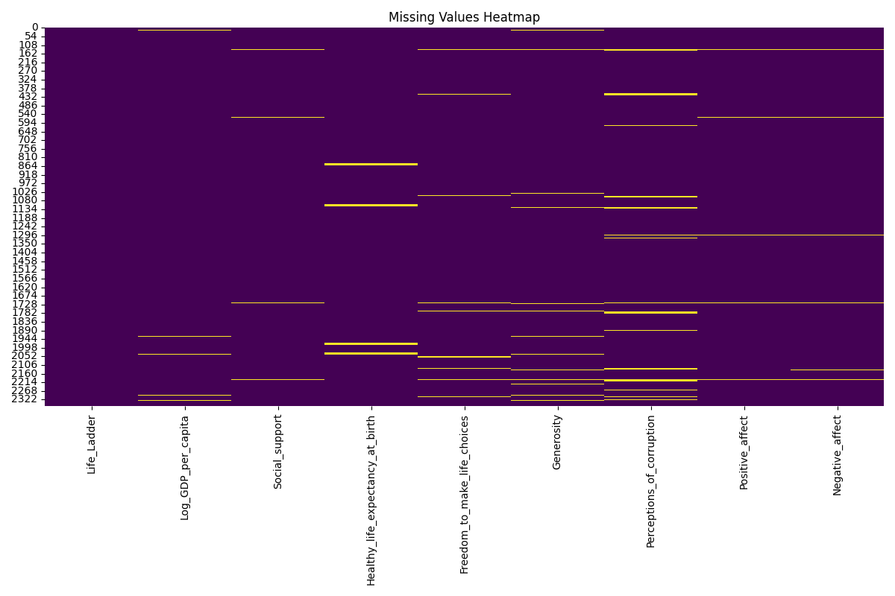

# Data Analysis Story for happiness.csv

## Summary Statistics
       Country_name         year  Life_Ladder  Log_GDP_per_capita  Social_support  Healthy_life_expectancy_at_birth  Freedom_to_make_life_choices   Generosity  Perceptions_of_corruption  Positive_affect  Negative_affect
count          2363  2363.000000  2363.000000         2335.000000     2350.000000                       2300.000000                   2327.000000  2282.000000                2238.000000      2339.000000      2347.000000
unique          165          NaN          NaN                 NaN             NaN                               NaN                           NaN          NaN                        NaN              NaN              NaN
top       Argentina          NaN          NaN                 NaN             NaN                               NaN                           NaN          NaN                        NaN              NaN              NaN
freq             18          NaN          NaN                 NaN             NaN                               NaN                           NaN          NaN                        NaN              NaN              NaN
mean            NaN  2014.763860     5.483566            9.399671        0.809369                         63.401828                      0.750282     0.000098                   0.743971         0.651882         0.273151
std             NaN     5.059436     1.125522            1.152069        0.121212                          6.842644                      0.139357     0.161388                   0.184865         0.106240         0.087131
min             NaN  2005.000000     1.281000            5.527000        0.228000                          6.720000                      0.228000    -0.340000                   0.035000         0.179000         0.083000
25%             NaN  2011.000000     4.647000            8.506500        0.744000                         59.195000                      0.661000    -0.112000                   0.687000         0.572000         0.209000
50%             NaN  2015.000000     5.449000            9.503000        0.834500                         65.100000                      0.771000    -0.022000                   0.798500         0.663000         0.262000
75%             NaN  2019.000000     6.323500           10.392500        0.904000                         68.552500                      0.862000     0.093750                   0.867750         0.737000         0.326000
max             NaN  2023.000000     8.019000           11.676000        0.987000                         74.600000                      0.985000     0.700000                   0.983000         0.884000         0.705000

## Outlier Counts
year                                 0
Life_Ladder                          2
Log_GDP_per_capita                   3
Social_support                      23
Healthy_life_expectancy_at_birth    14
Freedom_to_make_life_choices        10
Generosity                          21
Perceptions_of_corruption           34
Positive_affect                     10
Negative_affect                     18

## Story and Insights
### Insights and Analysis

#### Overview
The dataset consists of life satisfaction metrics and various socio-economic indicators across multiple countries from 2005 to 2023. The primary focus is on the "Life Ladder" score, which serves as a measure of self-reported well-being, and its correlation with factors such as GDP per capita, social support, and perceptions of corruption.

#### Key Insights

1. **Strong Correlation with Economic Indicators**:
   - The **Life Ladder** (well-being score) shows a high positive correlation with **Log GDP per capita** (0.78) and **Social Support** (0.72). This indicates that countries with higher economic performance and better social structures tend to have higher life satisfaction. 
   - **Healthy Life Expectancy** also shows a strong correlation (0.71) with Life Ladder, suggesting that health and longevity significantly impact perceived well-being.

2. **Social Support's Role**:
   - The correlation of **Social Support** with **Life Ladder** (0.72) and **Positive Affect** (0.42) highlights its importance in fostering well-being. Conversely, it has a substantial negative correlation with **Negative Affect** (-0.45), suggesting that social safety nets can help mitigate feelings of unhappiness or distress.

3. **Perceptions of Corruption**:
   - There is a notable negative correlation between **Perceptions of Corruption** and **Life Ladder** (-0.43). This implies that countries with higher corruption perceptions tend to report lower life satisfaction. These findings emphasize the importance of governance and trust in institutions for societal well-being.

4. **Generosity and Freedom**:
   - While the correlation of **Generosity** with Life Ladder is relatively low (0.18), it shows a positive link with **Positive Affect** (0.30), indicating that acts of giving may enhance individual happiness, albeit not as strongly as economic factors.
   - **Freedom to Make Life Choices** has a moderate positive correlation with Life Ladder (0.54) and Positive Affect (0.58), suggesting that personal autonomy plays a crucial role in shaping well-being.

5. **Negative Affect**:
   - Negative Affect shows a significant negative correlation with Life Ladder (-0.35), reinforcing the idea that lower levels of distress are associated with higher life satisfaction. Additionally, it correlates positively with Perceptions of Corruption (0.27), suggesting that widespread corruption can lead to increased anxiety and dissatisfaction.

#### Trends and Anomalies

- **Temporal Trends**: The data spans 2005 to 2023, indicating a potential longitudinal study could reveal how life satisfaction has changed over time in relation to economic shifts, particularly during global events (like the COVID-19 pandemic).
- **Outliers**: Outlier counts for various indicators (e.g., Life Ladder has 2 outliers) may indicate specific countries or instances where life satisfaction diverges significantly from expected socio-economic patterns. Further investigation into these outliers could reveal unique cultural or socio-political factors at play.

### Implications of Findings

1. **Policy Making**:
   - Governments should prioritize economic growth and social support systems to enhance citizens' well-being. Investments in healthcare and social safety nets are critical.
   - Anti-corruption measures should be a key focus, as trust in institutions is closely related to life satisfaction.

2. **Public Well-Being Programs**:
   - Programs aimed at increasing personal freedoms and promoting community engagement can help boost life satisfaction. Encouraging civic participation and volunteerism could enhance social bonds and collective well-being.

3. **Mental Health Initiatives**:
   - Given the correlation between negative affect and life ladder scores, mental health support programs should be integrated into public health strategies, particularly in nations with high corruption perceptions or economic distress.

4. **Further Research**:
   - The anomalies identified warrant deeper qualitative research to explore underlying reasons for outlier behaviors. Understanding these cases can provide insights into unique cultural dynamics affecting well-being.

### Suggested Actions

- **Governance Reforms**: Implement reforms to reduce corruption and increase transparency, thereby fostering trust in government institutions.
- **Economic Policies**: Design economic policies that focus on inclusive growth, ensuring that economic benefits reach marginalized communities.
- **Community Support Initiatives**: Foster social networks and community support systems to improve overall social cohesion and individual life satisfaction.
- **Regular Surveys**: Conduct regular well-being surveys to monitor changes over time and adjust policies accordingly.

### Conclusion

The dataset presents a compelling narrative about the factors influencing life satisfaction across countries. Understanding the interplay of economic conditions, social support, and governance can help in crafting policies aimed at enhancing the well-being of populations. As countries navigate the challenges of modern society, these insights can guide targeted interventions to improve life satisfaction and foster a more equitable world.

## Visualizations
### Correlation Plot

### Histogram

### Missing Values Heatmap

