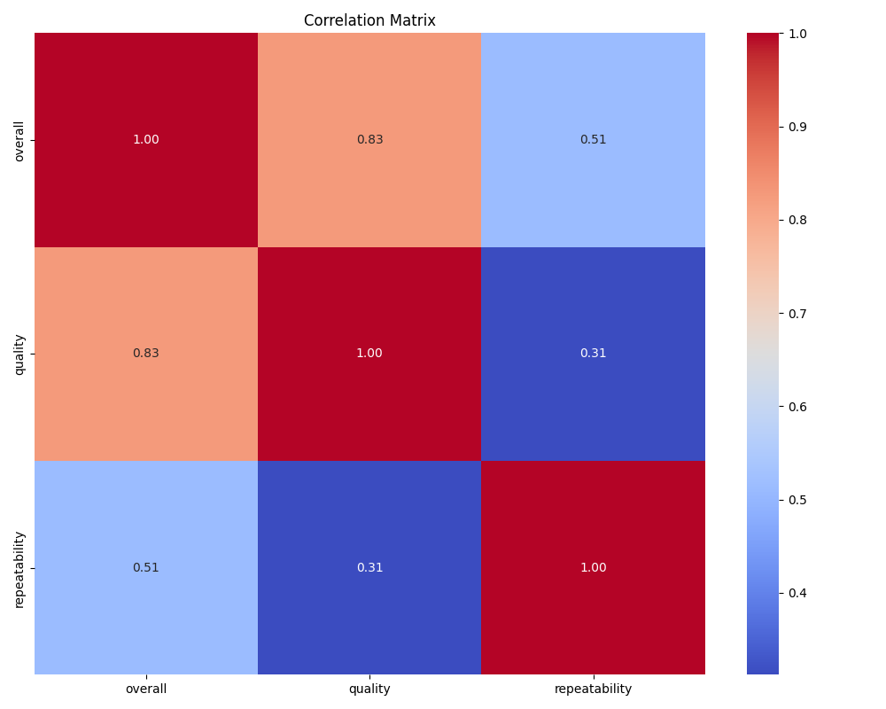
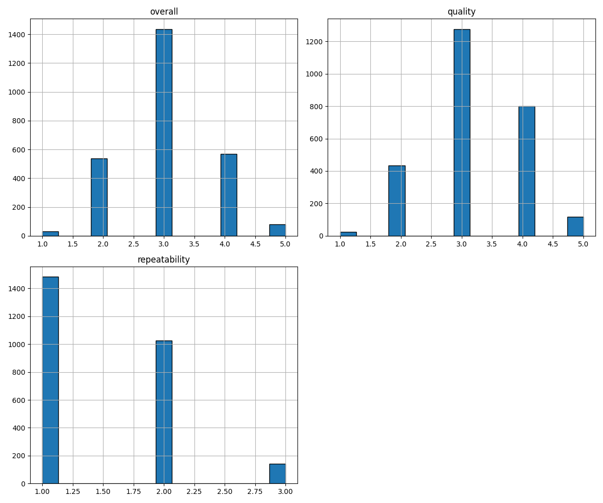

# Data Analysis Story for media.csv

### Summary Statistics

**date**:
  - count: 2553
  - unique: 2055.00
  - top: 21-May-06
  - freq: 8
  - mean: nan
  - std: nan
  - min: nan
  - 25%: nan
  - 50%: nan
  - 75%: nan
  - max: nan

**language**:
  - count: 2652
  - unique: 11.00
  - top: English
  - freq: 1306
  - mean: nan
  - std: nan
  - min: nan
  - 25%: nan
  - 50%: nan
  - 75%: nan
  - max: nan

**type**:
  - count: 2652
  - unique: 8.00
  - top: movie
  - freq: 2211
  - mean: nan
  - std: nan
  - min: nan
  - 25%: nan
  - 50%: nan
  - 75%: nan
  - max: nan

**title**:
  - count: 2652
  - unique: 2312.00
  - top: Kanda Naal Mudhal
  - freq: 9
  - mean: nan
  - std: nan
  - min: nan
  - 25%: nan
  - 50%: nan
  - 75%: nan
  - max: nan

**by**:
  - count: 2390
  - unique: 1528.00
  - top: Kiefer Sutherland
  - freq: 48
  - mean: nan
  - std: nan
  - min: nan
  - 25%: nan
  - 50%: nan
  - 75%: nan
  - max: nan

**overall**:
  - count: 2652.00
  - unique: nan
  - top: nan
  - freq: nan
  - mean: 3.05
  - std: 0.76
  - min: 1.00
  - 25%: 3.00
  - 50%: 3.00
  - 75%: 3.00
  - max: 5.00

**quality**:
  - count: 2652.00
  - unique: nan
  - top: nan
  - freq: nan
  - mean: 3.21
  - std: 0.80
  - min: 1.00
  - 25%: 3.00
  - 50%: 3.00
  - 75%: 4.00
  - max: 5.00

**repeatability**:
  - count: 2652.00
  - unique: nan
  - top: nan
  - freq: nan
  - mean: 1.49
  - std: 0.60
  - min: 1.00
  - 25%: 1.00
  - 50%: 1.00
  - 75%: 2.00
  - max: 3.00

## Outlier Counts
overall          0
quality          0
repeatability    0

## Story and Insights
### Data Analysis and Insights

#### Overview of the Dataset
The dataset comprises 2,652 records with various attributes related to content ratings across different languages and types. Key metrics include overall ratings, quality ratings, and repeatability scores. The dataset reveals the following characteristics:

- **Date Distribution**: There are 2,055 unique dates, indicating that the dataset spans a considerable time frame.
- **Language Diversity**: The dataset features 11 unique languages, with English being the most predominant (1,306 occurrences).
- **Type Variety**: The dataset includes 8 different types, with movies being the most common (2,211 instances).
- **Rating Distributions**: The overall ratings range from 1 to 5, with a mean of approximately 3.05, suggesting a moderate level of satisfaction among ratings.

#### Summary Statistics
- **Overall Ratings**: The mean overall rating is 3.05, with a standard deviation of 0.76, indicating variability in ratings. The distribution appears to be centered around the middle of the scale.
- **Quality Ratings**: The average quality score is 3.21, slightly above the overall ratings, suggesting that respondents generally perceive the quality of the content to be better than the overall experience.
- **Repeatability Scores**: The repeatability metric has a mean score of 1.49, with a maximum of 3. This low score indicates that many respondents are unlikely to engage with the content more than once.

#### Correlation Analysis
The correlation matrix reveals the following:

1. **Strong Correlation Between Overall and Quality Ratings**: The correlation coefficient of **0.83** between overall ratings and quality ratings indicates that as quality ratings increase, overall satisfaction tends to increase as well. This suggests that improving the perceived quality of content could directly enhance overall ratings.

2. **Moderate Correlation Between Overall Ratings and Repeatability**: The correlation of **0.51** shows that while there is a relationship between overall satisfaction and the likelihood of repeat engagement, it is not as strong as the relationship with quality.

3. **Weak Correlation Between Quality and Repeatability**: A correlation of **0.31** indicates that perceived quality does not strongly influence the likelihood of repeatability. This could suggest that even high-quality content may not always warrant repeat viewing or engagement.

### Trends and Anomalies

#### Insights
- **Engagement vs. Quality**: The data suggests that while quality influences overall ratings, it does not necessarily equate to repeat engagement. This could indicate that content, even if deemed high-quality, may not have enough appeal to encourage viewers to return.
- **Language and Type Influence**: With English dominating the dataset, it would be valuable to explore whether other languages or types yield different ratings. Content in languages other than English may have different audience expectations or cultural contexts affecting their ratings.

#### Anomalies
- **High Frequency of Certain Titles**: The title "Kanda Naal Mudhal" appears frequently (9 times). Investigating why certain titles garner multiple entries could reveal trends in popularity, marketing strategies, or audience targeting.

### Implications and Suggestions

1. **Quality Improvement Initiatives**: Given the strong correlation between quality and overall ratings, content creators and providers should focus on enhancing the quality of their offerings. This could involve investing in better production values, storytelling, or viewer engagement strategies.

2. **Content Diversification Strategy**: The low repeatability scores suggest a need for content diversification. Providers could explore creating sequels, spin-offs, or related content that encourages viewers to return. Additionally, catering to non-English languages may tap into new audience segments.

3. **Targeted Marketing Campaigns**: Given the relationship between ratings and language types, targeted marketing campaigns that emphasize high-quality content in various languages could attract a wider audience. Leveraging data analytics to understand viewer preferences across different languages and genres could enhance engagement.

4. **Feedback Mechanism**: Implementing a feedback mechanism to gather more nuanced data regarding why viewers do not return could provide insights into content shortcomings. Understanding viewer motivations and preferences will help shape future content strategies.

### Conclusion
The dataset provides valuable insights into content ratings across various dimensions. By understanding the relationships between overall ratings, quality, and repeatability, content providers can make informed decisions to enhance viewer satisfaction and engagement, ultimately leading to a more loyal audience base.

## Visualizations
### Correlation Plot

### Histogram

### Missing Values Heatmap

