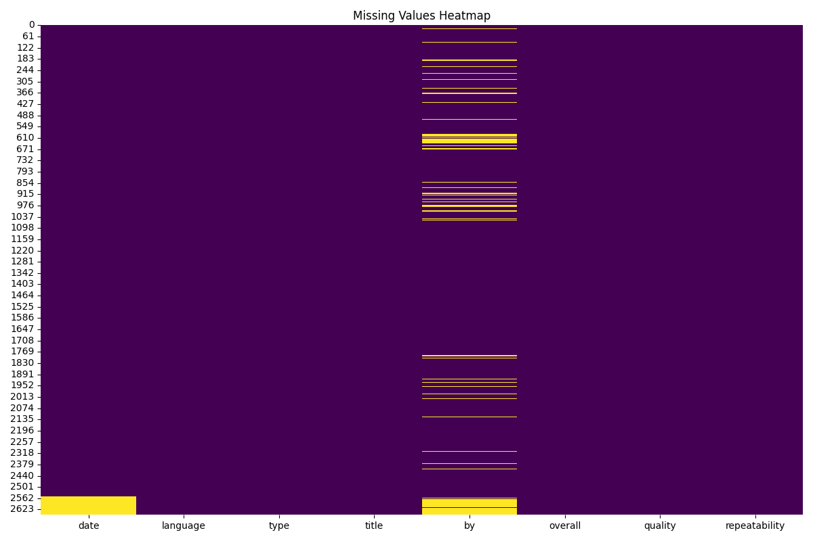

# Data Analysis Story for media.csv

## Summary Statistics
             date language   type              title                 by      overall      quality  repeatability
count        2553     2652   2652               2652               2390  2652.000000  2652.000000    2652.000000
unique       2055       11      8               2312               1528          NaN          NaN            NaN
top     21-May-06  English  movie  Kanda Naal Mudhal  Kiefer Sutherland          NaN          NaN            NaN
freq            8     1306   2211                  9                 48          NaN          NaN            NaN
mean          NaN      NaN    NaN                NaN                NaN     3.047511     3.209276       1.494721
std           NaN      NaN    NaN                NaN                NaN     0.762180     0.796743       0.598289
min           NaN      NaN    NaN                NaN                NaN     1.000000     1.000000       1.000000
25%           NaN      NaN    NaN                NaN                NaN     3.000000     3.000000       1.000000
50%           NaN      NaN    NaN                NaN                NaN     3.000000     3.000000       1.000000
75%           NaN      NaN    NaN                NaN                NaN     3.000000     4.000000       2.000000
max           NaN      NaN    NaN                NaN                NaN     5.000000     5.000000       3.000000

## Outlier Counts
overall          0
quality          0
repeatability    0

## Story and Insights
Based on the dataset you provided, we can derive several insights and trends. The dataset contains information on various items categorized by date, language, type, title, author (by), and three numerical metrics: overall, quality, and repeatability. 

### Insights and Trends:

1. **Language Dominance**:
   - The dataset contains entries in 11 different languages, with English being the most prevalent, appearing in 1,306 instances. This indicates a strong focus on English language content, which may suggest a target audience mostly fluent in English or a preference for English content.

2. **Type Distribution**:
   - The 'type' column has 8 distinct categories, with movies being the most common (2,211 occurrences). This suggests that the dataset heavily leans towards film-related content, possibly indicating a focus on entertainment.

3. **Quality and Overall Ratings**:
   - The overall rating has a mean of approximately 3.05, with a quality rating mean of approximately 3.21. The high correlation (0.8259) between overall and quality suggests that as the quality rating increases, the overall rating tends to increase as well. This could imply that users are generally satisfied with the quality of the items being rated.

4. **Repeatability Insights**:
   - The repeatability metric has a mean of 1.49, indicating that most items are rated once or twice, with only a few being rated multiple times. The correlation between overall and repeatability (0.5126) is moderate, suggesting that items that are rated higher tend to have more repeat ratings. This could indicate that popular items garner more attention over time.

5. **Lack of Outliers**:
   - The absence of outliers for overall, quality, and repeatability ratings suggests a consistent rating pattern across the dataset. This consistency may reflect a well-defined audience or standardized evaluation criteria.

### Anomalies:
- The highest frequency title, "Kanda Naal Mudhal," is rated 9 times, indicating it is a well-discussed or popular item within this dataset. However, the overall rating for this and similar titles isn’t provided, so further analysis into its reception could be beneficial.

### Implications of Findings:
- The dominance of English and film-related content suggests a need for diversification if the goal is to reach a broader audience. Introducing more content in other languages or types (e.g., TV shows, documentaries) could enhance engagement.
- The strong correlation between quality and overall ratings underscores the importance of maintaining high-quality standards to ensure user satisfaction.
- The repeatability data suggests that while items are generally not revisited, those that are rated multiple times tend to be of higher quality. This insight could inform marketing strategies to promote high-quality items more aggressively.

### Suggested Actions:
1. **Broaden Content Offerings**:
   - Consider expanding the dataset to include more diverse languages and types of content to attract a wider audience.

2. **Quality Control Initiatives**:
   - Implement a quality assurance program that focuses on maintaining or improving the quality ratings of items, as this directly impacts overall user satisfaction.

3. **Engagement Strategies**:
   - Develop strategies to encourage repeat ratings, such as incentives for users who revisit and rate items or create community discussions around popular titles.

4. **Analyze Popular Titles**:
   - Conduct a deeper analysis of the most popular titles (like "Kanda Naal Mudhal") to understand why they resonate with users. Use this information to inform future content creation and curation.

5. **Monitoring and Adjustments**:
   - Regularly monitor the dataset for emerging trends in user ratings and engagement to make timely adjustments to strategies.

### Conclusion:
The dataset provides valuable insights into user preferences and behaviors. By leveraging these insights, stakeholders can make informed decisions that enhance content offerings, improve user satisfaction, and potentially increase engagement and retention.

## Visualizations
### Correlation Plot

### Histogram

### Missing Values Heatmap

